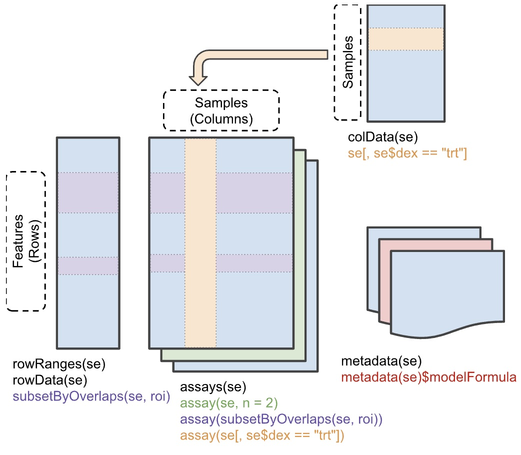
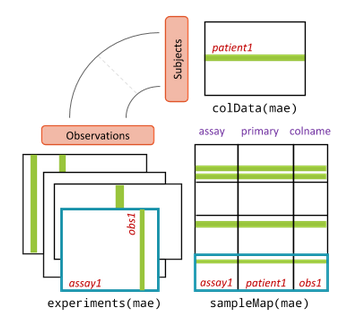

```{r helpercode,echo=FALSE,message=FALSE,results="hide"}
load("candesc.rda")
needed = c("curatedTCGAData", "TCGAutils", "dplyr", "kableExtra", "TCGAutils",
"survival", "GGally", "cBioPortalData", "GenomicRanges", "ggplot2")
ii = rownames(installed.packages())
need = setdiff(needed, ii)
if (length(need)>0) {
  print(need)
  stop("these packages are missing from your installation, please install")
}

library(curatedTCGAData)
library(TCGAutils)
library(GenomicRanges)
getcur = function (tiss) 
{
    curatedTCGAData(tiss, "*", version = "2.1.1", dry.run = FALSE)
}
getass = function(mae) gsub(".*_(.*)-.*", "\\1", gsub("TIC_", "TIC.", grep("mRNAA|CNAC", names(experiments(mae)), invert=TRUE, value=TRUE)))
load("tcgatab.rda")
library(dplyr)
library(kableExtra)
tenco = "Code,Type
ACC,Adrenocortical Carcinoma
BLCA,Bladder Urothelial Carcinoma
BRCA,Breast Invasive Carcinoma
CESC,Cervical Squamous Cell Carcinoma And Endocervical Adenocarcinoma
CHOL,Cholangiocarcinoma
COAD,Colon Adenocarcinoma
DLBC,Lymphoid Neoplasm Diffuse Large B-cell Lymphoma
ESCA,Esophageal Carcinoma
GBM,Glioblastoma Multiforme
HNSC,Head And Neck Squamous Cell Carcinoma"
cotab = read.csv(textConnection(tenco))


trim = function(x) {
  tmp = gsub(".*_(.*)", "\\1", x)
#  hasm = grep("meth", tmp)
#  if (length(hasm)>0)
  tmp = gsub("meth", "Methylation_meth", tmp)
  tmp = gsub("AllBy", "GISTIC_AllBy", tmp)
  tmp = gsub("Thresh", "GISTIC_Thresh", tmp)
  tmp = gsub("Peaks", "GISTIC_Peaks", tmp)
  tmp
}
common_assays = function(mael) {
  tmp =  lapply(mael, function(x)trim(names(experiments(x))))
  if (length(mael)==1) return(tmp[[1]])
  c1 = intersect(tmp[[1]], tmp[[2]])
  if (length(mael)==2) return(c1)
  for (i in 3:length(mael)) c1 = intersect(c1, tmp[[i]])
  c1
}
if (!exists("br")) br = getcur("BRCA")
if (!exists("gb")) gb = getcur("GBM")
if (!exists("luad")) luad = getcur("LUAD")
lu = luad
cass = common_assays(list(br, gb, lu))
kpass = lapply(c("BRCA", "GBM", "LUAD"), function(x) paste0(x, "_", cass))
bas = list(br, gb, lu)
suppressWarnings({
lim = lapply(1:3, function(x) bas[[x]][,,kpass[[x]]])
nc = sapply(lim, function(x) sapply(experiments(x), ncol))
})
library(TCGAutils)
ow = options()$warn
options(warn=-1)
suppressWarnings({
nc2 = sapply(lim, function(x) sapply(experiments(TCGAprimaryTumors(x[,,-9])), ncol))
})
options(warn=ow)

ans = cbind(nc2, nc[-9,]- nc2)
rownames(ans) = gsub("BRCA_", "", rownames(ans))
rownames(ans) = gsub("-.*", "", rownames(ans))
ans = ans[,c(1,4,2,5,3,6)]
colnames(ans) = c("BRCA", "BRCAnormal", "GBM", "GBMnormal", "LUAD", "LUADnormal")
assaycounts = ans
```


# Introduction

Computation is a central component of cancer genomics
research.  Tumor sequencing is the basis of computational
investigation of mutational, epigenetic and immunologic
processes associated with cancer initiation and progression.
Numerous computational workflows have been produced to
profile tumor cell transcriptomes and proteomes.
New technologies promise to unite sequence-based
characterizations with digital histopathology,
ultimately driving efforts in molecule design
and evaluation to produce patient-centered treatments.

Bioconductor is an open source software project with
a 20 year history of uniting biostatisticians, bioinformaticians,
and genome researchers in the creation of an ecosystem
of data, annotation, and analysis resources for research
in genome-scale biology.  This paper will review current
approaches of the project to advancing cancer genomics.
After a brief discussion of basic principles of the Bioconductor
project, we will present a "top down" survey of resources
useful for cancer bioinformatics.  Primary sections address

- how to explore institutionally curated cancer genomics data
- genomic annotation resources relevant to cancer genomics
- analytical workflows
- components for introducing new data or analyses
- pedagogics and workforce development.

The appendix (section \@ref(app1)) of this paper includes descriptions of `r nrow(candesc)`
Bioconductor software packages that use the term "cancer" in their package metadata.

# Bioconductor principles

## R packages and vignettes

Software tools and data resources in Bioconductor are organized
into "R packages".  These are collections of folders with data,
code (principally R functions), and documentation 
following a protocol specified in
[Writing R Extensions](https://cran.r-project.org/doc/manuals/R-exts.html).  R packages have a DESCRIPTION file with metadata about
package contents and provenance.  Package structure can be
checked for validity using the `R CMD check` facility.
Documentation of code and data can be programmatically
checked for existence and validity.  The DESCRIPTION file
for a package specifies its version and
also gives precise definition of how an R package may
depend upon versions of other packages.

At its inception, 
Bioconductor introduced a new approach to holistic package
documentation called "vignette".
Vignettes narrate package operations
and include executable code.
While R function manual pages describe
the operation of individual functions,
vignettes illustrate the interoperation
of package components.

## R package repositories; repository evolution

Bioconductor software forms a coherent ecosystem that
can be checked for consistency of versions of all
packages available in a given installation of R.
Bioconductor packages may specify dependency on
other Bioconductor packages, or packages that are
available in the CRAN repository.  Bioconductor does
not include packages with dependencies on "github-only"
packages.  Later in this paper we will provide details
on package quality assurance that provide a rationale
for this restriction.

Major updates to the R language occur annually, and
updates are preceded by careful assessment of effects of
language change on package operations.  These effects
can be identified through changes in the output of R CMD check.
The Bioconductor ecosystem is updated twice a year, once
to coincide with update to R, and once about six months
later.  The semianual updates reflect the need to track
developments in the fast-moving field of genomic data science.

## Package quality assessment; installation consistency

The BiocCheck function is used to provide more
stringent assessment of package compliance with basic
principles of the Bioconductor ecosystem.

The BiocManager package includes code for
checking the consistency and
currency of the current
collection of installed packages, and for
installing or updating packages.  This is important
in the context of a language and package ecosystem
that changes every six months, while analyses may
take years to complete.  Tools for recreating past
package collections are available to assist in
reproducing outputs of prior analyses.

## Unifying assay and sample data: SummarizedExperiment and MultiAssayExperiment

Most of the data from genome-scale experiments to be discussed
in this chapter are organized in special data containers
rooted in the concepts of the SummarizedExperiment class.
Briefly, assay data are thought of as occupying a $G \times N$
array, and sample level data occupy an $N \times K$ table.  The array
and the table are linked together in the SummarizedExperiment; see Figure \@ref(fig:sesc).


```{r sesc, echo=FALSE, fig.cap="SummarizedExperiment schematic.", out.width="80%"}

```
Multiple representations of assay results may be managed in this
structure, but all assay arrays must have dimensions $G \times N$.

For experiment collections in which the same samples are subjected
to multiple genome-scale assays, MultiAssayExperiment containers are used.

```{r masc, echo=FALSE, fig.cap="MultiAssayExperiment schematic.", out.width="80%"}

```
Further details on these data structures will be provided in section \@ref(class).

# Exploring institutionally curated cancer genomics data

## The Cancer Genome Atlas

An overview of Bioconductor's resource for the Cancer
Genome Atlas (TCGA) is easy to obtain, with the
curatedTCGAData package.
```{r lktcga1,message=FALSE,eval=FALSE}
library(curatedTCGAData)
tcgatab = curatedTCGAData(version="2.1.1")
```
The first 10 records are in Table \@ref(tab:tab-lktab).
```{r tab-lktab,echo=FALSE}
kbl(head(tcgatab[,1:4],10), booktabs=TRUE, caption="First ten records
returned by curatedTCGAData::curatedTCGAData().")
```

Various conventions are in play in this table.  The "title" field is
of primary concern.  The title string can be decomposed into
substrings with interpretation
`[tumorcode]_[assay]-[date]_[optional codes]`.  The column `ah_id` will be
explained in section \@ref(hubs), and column
`rdataclass` will be discussed in section \@ref(class) below.

### Tumor code resolution

There are 33 different tumor types available in TCGA.  The
decoding of tumor codes for the first ten in alphabetical order is
provided in Table \@ref(tab:tab-deco).

```{r tab-deco,echo=FALSE}
kbl(cotab, booktabs=TRUE, caption="Decoding TCGA tumor code abbreviations.")
```

### Assay codes and counts

Assays performed on tumors vary across tumor types.  For assay
types shared between
breast cancer, glioblastoma, and lung adenocarcinoma (code LUAD),
the numbers of tumor and normal samples available in curatedTCGAData
are provided in Table \@ref(tab:tab-doassc).

```{r tab-doassc,echo=FALSE}
kbl(assaycounts, booktabs=TRUE,caption="Numbers of assays available in TCGA on tumor and normal samples,
for breast cancer, glioblastoma, and lung adenocarcinoma.")
```

### An example dataset for RNA-seq from glioblastoma multiforme

We obtain normalized RNA-seq data on primary tumor samples for GBM with
```{r getgb, cache=FALSE,message=FALSE}
gbrna = TCGAprimaryTumors(curatedTCGAData("GBM", 
    "RNASeq2GeneNorm", dry.run=FALSE, version="2.1.1"))
gbrna
```

R functions defined in Bioconductor packages can operate on the variable `gb` to
retrieve information of interest.  Details on the underlying data structure
are given in section \@ref(class) below.  For most assay types, we think of the quantitative
assay
information as tabular in nature, with table rows corresponding to genomic
features such as genes, and table columns corresponding to samples.

Information on GBM samples employs the `colData` function.
```{r lkcd}
dim(colData(gbrna))
```
For sample level information obtained `colData`, we think of rows
as samples, and columns as sample attributes.

### Clinical and phenotypic data

TCGA datasets are generally provided as combinations of
results for tumor tissue and normal tissue.  The determination
of a record's sample type is encoded in the sample "barcode".
Decoding of sample barcodes is described at the [Genomic Data Commons Encyclopedia](https://docs.gdc.cancer.gov/Encyclopedia/pages/TCGA_Barcode/) with specific interpretation of sample types listed [separately](https://gdc.cancer.gov/resources-tcga-users/tcga-code-tables/sample-type-codes).  The TCGAutils package provides utilities for extracting
data on primary tumor samples, excluding samples that may have been taken on
normal tissue or metastases.


Clinical and phenotypic data on all TCGA samples are voluminous.  For example,
there are `r ncol(colData(br))` fields of sample level data for BRCA 
samples, and `r ncol(colData(gb))` fields for GBM samples.  Many of these
fields are meaningfully populated for only a very small minority of samples.
To see this for GBM:
```{r lkspar}
mean(sapply(colData(gb), function(x) mean(is.na(x))>.90))
```

Nevertheless, with careful inspection of fields and contents,
clinical data can be extracted and combined with molecular
and genetic assay data with modest effort.

The following code chunk illustrates a very crude
approach to comparing survival profiles for BRCA, GBM, and LUAD
donors.

```{r dothesurv,fig.cap="Survival profile extraction from three MultiAssayExperiments produced with curatedTCGAData calls.", out.width="80%"}
library(survival)
getSurv = function(mae) {
 days_on = with(colData(mae), ifelse(is.na(days_to_last_followup), 
    days_to_death, days_to_last_followup))
 Surv(days_on, colData(mae)$vital_status)
}
ss = lapply(list(br, gb, lu), getSurv)
codes = c("BRCA", "GBM", "LUAD")
type = factor(rep(codes, sapply(ss,length)))
allsurv = do.call(c, ss)
library(GGally)
ggsurv(survfit(allsurv~type))
```


## cBioPortal

The [cBioPortal](https://www.cbioportal.org/) user guide 
defines the goal of the portal to be reducing "the barriers between complex 
genomic data and cancer researchers by providing rapid, intuitive, and high-quality 
access to molecular profiles and clinical attributes from large-scale cancer genomics projects, and 
therefore to empower researchers to translate these rich data sets into biologic insights and clinical applications."

Bioconductor's cBioPortalData package simplifies access to over 300 genomic studies of
diverse cancers in cBioPortal.  The main unit of data access is the publication.  The
`cBioPortal` function mediates a connection between an R session and the
cBioPortal API.  `getStudies` returns a tibble with metadata on
all studies.

```{r getcb,message=FALSE}
library(cBioPortalData)
cbio = cBioPortal()
allst = getStudies(cbio)
dim(allst)
```

A pruned selection of records from the cBioPortal
studies table is given in Table \@ref(tab:tab-cball).

```{r tab-cball,echo=FALSE}
filt = allst |> filter(!grepl("TCGA", name)) |> 
  mutate(name=gsub(" \\(.*", "", name), description = substr(description,1,20)) |> 
  dplyr::select(name, description, studyId, pmid) |> as.data.frame() |> head(10) 
kbl(filt,booktabs=TRUE,caption="Excerpts from four fields on selected records in the cBioPortal getStudies output.")
```

To explore copy number alteration data from a study on angiosarcoma,
we find the associated studyId field in `allst` and use the `cBioDataPack` function
to retrieve a MultiAssayExperiment:
```{r lkang,message=FALSE}
ann = "angs_project_painter_2018"
ang = cBioDataPack(ann)
ang
```

The copy number alteration outcomes are in the
`assay` component of the experiment.
```{r lkcna}
seg = experiments(ang)[[1]]
colnames(seg) = sapply(strsplit(colnames(seg), "-"), "[", 5)
assay(seg)[1:4,1:4]
```

The rownames component of this matrix can be transformed to
a GenomicRanges instance for concise manipulation.

```{r dodensity}
library(GenomicRanges)
library(ggplot2)
allalt = GRanges(rownames(assay(seg)))
allalt
```

We'll focus on chromosome 17, where TP53 is found.  Regions
of genomic alteration are summarized to their midpoints.

```{r mkden, fig.cap="Density of recurrent genomic alterations on chromosome 17 for 48 angiosarcoma patients."}
g17 = allalt[seqnames(allalt)=="17"]
df17 = as(g17, "data.frame")        # for ggplot2
df17$mid = .5*(df17$start+df17$end) # midpoint only
ggplot(df17, aes(x=mid)) + geom_density(bw=.2) + xlab("chr 17 bp")
```

This display shows a strong peak in the vicinity of 7.5 Mb on chromosome 17, near TP53.
The display lacks information on the direction of copy number alteration, and on annotation
of the genome.  These issues will be addressed in later sections.

## Resources from NCBI and EMBL

# Genomic annotation resources relevant to cancer {#hubs}

# Analytical workflows

# Components for introducing new data or analyses {#class}


<!-- How Bioconductor enhances cancer data reuse and value - Levi, Sean, Sehyun -->

## Data structures

Inheritance is a key feature of object-oriented programming (OOP) that allows us to define a new class out of existing classes and add new features, which provides reusability of code. Inheritance carries over attributes and methods defined for base classes; ‘Attributes’ are variables that are bound in a class. They are used to define behavior and methods for objects of that class. ‘Methods’ are functions defined within a class that receive an instance of the class, conventionally called self, as the first argument. The attributes defined for a base class will automatically be present in the derived class, and the methods for the base class will work for the derived class. The R programming language has three different class systems: S3, S4, and Reference. Inheritance in S3 classes does not have any fixed definition, and hence attributes of S3 objects can be arbitrary. Derived classes, however, inherit the methods defined for the base class. Inheritance in S4 classes is more structured, and derived classes inherit both attributes and methods of the parent class. Reference classes are similar to S4 classes, but they are mutable and have reference semantics.

S4 classes are used extensively in Bioconductor to create data structures that store complex information, such as biological assay data and metadata, in one or more slots. The entire structure can then be assigned to an R object, and the types of information in each slot of the object are tightly controlled. S4 generics and methods define functions that can be applied to these objects, providing a rich software development infrastructure while ensuring interoperability, reusability, and efficiency. 

Bioconductor have established Bioconductor classes to represent different types of biological data. Data and tools distributed through Bioconductor adopt Bioconductor classes, providing convenient methods and improving usability and interoperability within the Bioconductor ecosystem. 

```{r mktab,echo=FALSE,messages=FALSE}
ltab = "Data Types:Bioconductor Classes
Genomic coordinates (1-based, closed interval):GRanges
Groups of genomic coordinates:GRangesList
Ragged genomic coordinates:RaggedExperiment
Gene sets:GeneSet
Rectangular Features x samples:SummarizedExperiment
Multi-omics data:MultiAssayExperiment
Single-cell data:SingleCellExperiment
Mass spectrometry data:Spectra"
x = read.delim(textConnection(ltab),sep=":",check.names=FALSE)
suppressMessages({library(kableExtra)})
kbl(x, booktabs=TRUE) 
```

The GRanges class represents a collection of genomic ranges and associated annotations. Each element in the vector represents a set genomic ranges in terms of the sequence name (seqnames, typically the chromosome), start and end coordinates (ranges, as an IRanges object), strand (strand, either positive, negative, or unstranded), and optional metadata columns (e.g., exon_id and exon_name in the below). 

```
GRanges object with 4 ranges and 2 metadata columns:
      seqnames            ranges strand |   exon_id       exon_name
         <Rle>         <IRanges>  <Rle> | <integer>     <character>
  [1]        X 99883667-99884983      - |    667145 ENSE00001459322
  [2]        X 99885756-99885863      - |    667146 ENSE00000868868
  [3]        X 99887482-99887565      - |    667147 ENSE00000401072
  [4]        X 99887538-99887565      - |    667148 ENSE00001849132
  -------
  seqinfo: 722 sequences (1 circular) from an unspecified genome
```

The GRangesList object serves as a container for genomic features consisting of multiplie ranges that are grouped by a parent features, such as spliced transcripts that are comprised of exons. A GRangesList object behaves like a list and many of the same methods for GRanges objects are available for GRangesList object as well. 

The SummarizedExperiment class is a matrix-like container, where rows represent features of interest (e.g., genes, transcripts, exons, etc.) and columns represent samples. The attributes of this object include experimental results (in assays), information on observations (in rowData) and samples (in colData), and additional metadata (in metadata). SummarizedExperiment objects can simultaneouly manage several experimental results as long as they are of the same dimensions. The best benefit of using SummarizedExperiment class is the coordination of the metadata and assays when subsetting. SummarizedExperiment is similar to the historical ExpressionSet class, but more flexible in its row information, allowing both GRanges and DataFrames. ExpressionSet object can be easily converted to SummarizedExperiment.

RangedSummarizedExperiment inherits the SummarizedExperiment class, with the extended capability of storing genomic ranges (as a GRanges or GRangesList object) of interest instead of a DataFrame (S4-class objectcs similar to data.frame) of features in rows.

The MultiAssayExperiment class is modeled after the SummarizedExperiment class.

The SingleCellExperiment classes inherit from the RangedSummarizedExperiment class.

# Pedagogics and workforce development


```{r wssc, echo=FALSE, fig.cap="Workshop.bioconductor.org schematic.", out.width="80%"}

```

# Appendix - Bioconductor software packages with 'cancer' in package description {#app1}

```{r tab-fintab, caption="Bioconductor packages mentioning cancer in package description.", echo=FALSE}
kbl(as.data.frame(candesc), booktabs=TRUE, longtable=TRUE) %>% column_spec(2, width="40em") %>%
 kable_styling("repeat_header")
#longtable = TRUE, caption = "Test") %>%
#  kable_styling(latex_options = c("hold_position", "repeat_header")) ```
```

<!--
```{r tab-fintab7, caption="Bioconductor packages mentioning cancer in package description.", echo=FALSE, eval=FALSE}
kbl(as.data.frame(candesc[1:10,]), booktabs=TRUE) %>% column_spec(2, width="40em")
```
```{r tab-fintab2, caption="Bioconductor packages mentioning cancer in package description.", echo=FALSE, eval=FALSE}
kbl(as.data.frame(candesc[11:17,]), booktabs=TRUE) %>% column_spec(2, width="40em")
```
```{r tab-fintab3, caption="Bioconductor packages mentioning cancer in package description.", echo=FALSE, eval=FALSE}
kbl(as.data.frame(candesc[18:23,]), booktabs=TRUE) %>% column_spec(2, width="40em")
```
```{r tab-fintab4, caption="Bioconductor packages mentioning cancer in package description.", echo=FALSE, eval=FALSE}
kbl(as.data.frame(candesc[24:30,]), booktabs=TRUE) %>% column_spec(2, width="40em")
```
```{r tab-fintab5, caption="Bioconductor packages mentioning cancer in package description.", echo=FALSE, eval=FALSE}
kbl(as.data.frame(candesc[31:36,]), booktabs=TRUE) %>% column_spec(2, width="40em")
```
```{r tab-fintab6, caption="Bioconductor packages mentioning cancer in package description.", echo=FALSE, eval=FALSE}
kbl(as.data.frame(candesc[36:42,]), booktabs=TRUE) %>% column_spec(2, width="40em")
```
-->
