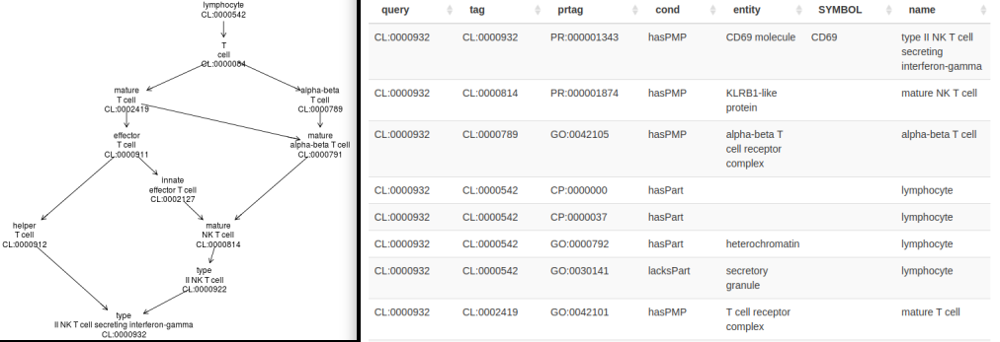
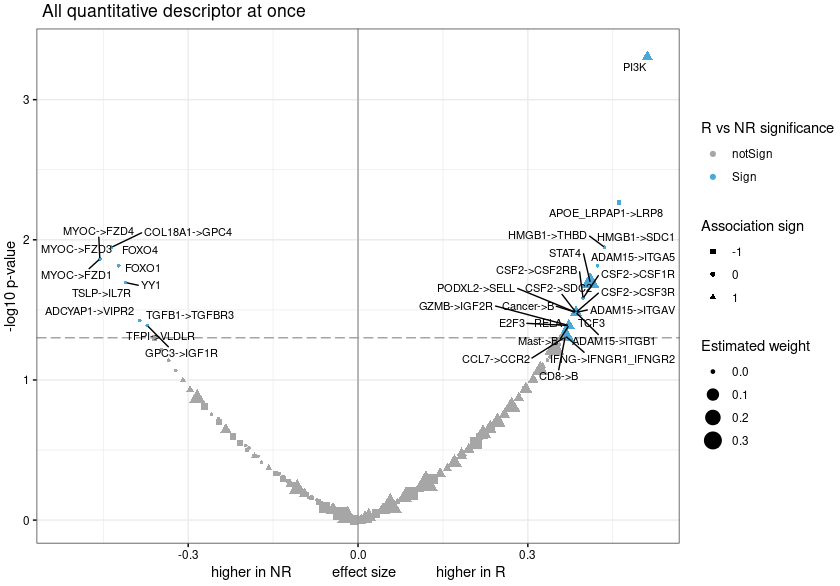

```{r helpercode,echo=FALSE,message=FALSE,results="hide"}
load("candesc.rda")
load("candesc2.rda")
load("datadesc.rda")
load("datadesc2.rda")
load("easvig.rda")
load("wflowtab.rda")
needed = c("curatedTCGAData", "TCGAutils", "dplyr", "kableExtra", "TCGAutils",
"survival", "GGally", "cBioPortalData", "GenomicRanges", "ggplot2",
"BiocFileCache", "ExperimentHub", "AnnotationHub", "TumourMethData",
"BiocStyle", "ensembldb", "rols", "GO.db", "msigdb", "easierData",
"SpatialFeatureExperiment", "SFEData", "EnsDb.Hsapiens.v86")
ii = rownames(installed.packages())
need = setdiff(needed, ii)
if (length(need)>0) {
  zz = paste(need, collapse=", ")
  stop(sprintf("these packages (%s)\n are missing from your installation, please install", zz))
}

library(curatedTCGAData)
library(TCGAutils)
library(GenomicRanges)
getcur = function (tiss) 
{
    curatedTCGAData(tiss, "*", version = "2.1.1", dry.run = FALSE)
}
getass = function(mae) gsub(".*_(.*)-.*", "\\1", gsub("TIC_", "TIC.", grep("mRNAA|CNAC", names(experiments(mae)), invert=TRUE, value=TRUE)))
load("tcgatab.rda")
library(dplyr)
library(kableExtra)
tenco = "Code,Type
ACC,Adrenocortical Carcinoma
BLCA,Bladder Urothelial Carcinoma
BRCA,Breast Invasive Carcinoma
CESC,Cervical Squamous Cell Carcinoma And Endocervical Adenocarcinoma
CHOL,Cholangiocarcinoma
COAD,Colon Adenocarcinoma
DLBC,Lymphoid Neoplasm Diffuse Large B-cell Lymphoma
ESCA,Esophageal Carcinoma
GBM,Glioblastoma Multiforme
HNSC,Head And Neck Squamous Cell Carcinoma"
cotab = read.csv(textConnection(tenco))


trim = function(x) {
  tmp = gsub(".*_(.*)", "\\1", x)
#  hasm = grep("meth", tmp)
#  if (length(hasm)>0)
  tmp = gsub("meth", "Methylation_meth", tmp)
  tmp = gsub("AllBy", "GISTIC_AllBy", tmp)
  tmp = gsub("Thresh", "GISTIC_Thresh", tmp)
  tmp = gsub("Peaks", "GISTIC_Peaks", tmp)
  tmp
}
common_assays = function(mael) {
  tmp =  lapply(mael, function(x)trim(names(experiments(x))))
  if (length(mael)==1) return(tmp[[1]])
  c1 = intersect(tmp[[1]], tmp[[2]])
  if (length(mael)==2) return(c1)
  for (i in 3:length(mael)) c1 = intersect(c1, tmp[[i]])
  c1
}
if (!exists("br")) br = getcur("BRCA")
if (!exists("gb")) gb = getcur("GBM")
if (!exists("luad")) luad = getcur("LUAD")
lu = luad
cass = common_assays(list(br, gb, lu))
kpass = lapply(c("BRCA", "GBM", "LUAD"), function(x) paste0(x, "_", cass))
bas = list(br, gb, lu)
suppressWarnings({
lim = lapply(1:3, function(x) bas[[x]][,,kpass[[x]]])
nc = sapply(lim, function(x) sapply(experiments(x), ncol))
})
library(TCGAutils)
ow = options()$warn
options(warn=-1)
suppressWarnings({
nc2 = sapply(lim, function(x) sapply(experiments(TCGAprimaryTumors(x[,,-9])), ncol))
})
options(warn=ow)

ans = cbind(nc2, nc[-9,]- nc2)
rownames(ans) = gsub("BRCA_", "", rownames(ans))
rownames(ans) = gsub("-.*", "", rownames(ans))
ans = ans[,c(1,4,2,5,3,6)]
colnames(ans) = c("BRCA", "BRCAnormal", "GBM", "GBMnormal", "LUAD", "LUADnormal")
assaycounts = ans
```


# Introduction

Computation is a central component of cancer genomics
research.  Tumor sequencing is the basis of computational
investigation of mutational, epigenetic and immunologic
processes associated with cancer initiation and progression.
Numerous computational workflows have been produced to
profile tumor cell transcriptomes and proteomes.
New technologies promise to unite sequence-based
characterizations with digital histopathology,
ultimately driving efforts in molecule design
and evaluation to produce patient-centered treatments.

Bioconductor is an open source software project with
a 20 year history of uniting biostatisticians, bioinformaticians,
and genome researchers in the creation of an ecosystem
of data, annotation, and analysis resources for research
in genome-scale biology.  This paper will review current
approaches of the project to advancing cancer genomics.
After a brief discussion of basic principles of the Bioconductor
project, we will present a "top down" survey of resources
useful for cancer bioinformatics.  Primary sections address

- how to explore institutionally curated cancer genomics data
- genomic annotation resources relevant to cancer genomics
- analytical workflows
- components for introducing new data or analyses
- pedagogics and workforce development.

Appendix 1 (section \@ref(app1)) of this paper includes descriptions of `r nrow(candesc2)`
Bioconductor software packages that use the term "cancer" in their package metadata.

Appendix 2 (section \@ref(app2)) of this paper includes descriptions of `r nrow(datadesc2)`
Bioconductor experimental data packages that use the term "cancer" in their package metadata.

# Bioconductor principles

## R packages and vignettes

Software tools and data resources in Bioconductor are organized
into "R packages".  These are collections of folders with data,
code (principally R functions), and documentation 
following a protocol specified in
[Writing R Extensions](https://cran.r-project.org/doc/manuals/R-exts.html).  R packages have a DESCRIPTION file with metadata about
package contents and provenance.  Package structure can be
checked for validity using the `R CMD check` facility.
Documentation of code and data can be programmatically
checked for existence and validity.  The DESCRIPTION file
for a package specifies its version and
also gives precise definition of how an R package may
depend upon versions of other packages.

At its inception, 
Bioconductor introduced a new approach to holistic package
documentation called "vignette".
Vignettes narrate package operations
and include executable code.
While R function manual pages describe
the operation of individual functions,
vignettes illustrate the interoperation
of package components.

## R package repositories; repository evolution

Bioconductor software forms a coherent ecosystem that
can be checked for consistency of versions of all
packages available in a given installation of R.
Bioconductor packages may specify dependency on
other Bioconductor packages, or packages that are
available in the CRAN repository.  Bioconductor does
not include packages with dependencies on "github-only"
packages.  Later in this paper we will provide details
on package quality assurance that provide a rationale
for this restriction.

Major updates to the R language occur annually, and
updates are preceded by careful assessment of effects of
language change on package operations.  These effects
can be identified through changes in the output of R CMD check.
The Bioconductor ecosystem is updated twice a year, once
to coincide with update to R, and once about six months
later.  The semianual updates reflect the need to track
developments in the fast-moving field of genomic data science.

## Package quality assessment; installation consistency

The BiocCheck function is used to provide more
stringent assessment of package compliance with basic
principles of the Bioconductor ecosystem.

The BiocManager package includes code for
checking the consistency and
currency of the current
collection of installed packages, and for
installing or updating packages.  This is important
in the context of a language and package ecosystem
that changes every six months, while analyses may
take years to complete.  Tools for recreating past
package collections are available to assist in
reproducing outputs of prior analyses.

## Unifying assay and sample data: SummarizedExperiment and MultiAssayExperiment

Most of the data from genome-scale experiments to be discussed
in this chapter are organized in special data containers
rooted in the concepts of the SummarizedExperiment class.
Briefly, assay data are thought of as occupying a $G \times N$
array, and sample level data occupy an $N \times K$ table.  The array
and the table are linked together in the SummarizedExperiment; see Figure \@ref(fig:sesc).


```{r sesc, echo=FALSE, fig.cap="SummarizedExperiment schematic.", out.width="80%"}
knitr::include_graphics("SEschema.png")
```
Multiple representations of assay results may be managed in this
structure, but all assay arrays must have dimensions $G \times N$.

For experiment collections in which the same samples are subjected
to multiple genome-scale assays, MultiAssayExperiment containers are used.See \@ref(fig:masc) for the layout.

```{r masc, echo=FALSE, fig.cap="MultiAssayExperiment schematic.", out.width="80%"}
knitr::include_graphics("MAEschema.png")
```
Further details on these data structures will be provided in section \@ref(class).

## Downloading and caching {#cache}

Downloading and managing data from various online resources
can be extremely time consuming.  Bioconductor encourages data caching for
increased efficiency and reproducibility.  The caching data methods
employed in Bioconductor
allow analysis code to
concisely refer to data resources as needed, with minimal attention to how
data are stored, retrieved or transformed.
It allows for easy management and reuse of data that are on remote
servers or in cloud, storing source
location and providing information for data updates. The BiocFileCache
Bioconductor package handles data management from within R.

BiocFileCache is a general-use caching system but Bioconductor also provides
"Hubs", AnnotationHub and ExperimentHub, to help distributed annotation or
experimental data hosted externally. Both AnnotationHub and ExperimentHub use
BiocFileCache to handle download and caching of data.

AnnotationHub provides a centralized repository of diverse genomic annotations,
facilitating easy access and integration into analyses. Researchers can
seamlessly retrieve information such as genomic features, functional
annotations, and variant data, streamlining the annotation process for their
analyses.

ExperimentHub extends this concept to experimental data. It serves as a
centralized hub for storing and sharing curated experiment-level datasets,
allowing researchers to access a wide range of experimental designs and
conditions. This cloud-based infrastructure enhances collaboration and promotes
the reproducibility of analyses across different laboratories.

The curatedTCGAData package provides some resources through
ExperimentHub, as do many other self-identified "CancerData" resources. Once the
ExperimentHub is loaded, it can be queried for terms of interest.

```{r useeh}
library(ExperimentHub)
eh <- ExperimentHub()
query(eh, "curatedTCGAData")
query(eh, "CancerData")
```
Multiple terms can be used to narrow results before choosing a download.

```{r doeso}
query(eh, c("cancerData", "esophageal"))
eh['EH8527']
wgbs_rse <- eh[['EH8527']]
```

Similarly AnnotationHub files can be downloaded for annotating data. For example
the ensembl 110 release of gene and protein annotations are obtained with the
following:


```{r annochk}
library(AnnotationHub)
ah <- AnnotationHub()
tag = names(query(ah, c("Ensembl","110", "Homo sapiens")))
tag
ens110 <- ah[[tag]]
ens110
```

# Exploring institutionally curated cancer genomics data

## The Cancer Genome Atlas

An overview of Bioconductor's resource for the Cancer
Genome Atlas (TCGA) is easy to obtain, with the
curatedTCGAData package.
```{r lktcga1,message=FALSE,eval=FALSE}
library(curatedTCGAData)
tcgatab = curatedTCGAData(version="2.1.1")
```
The first 10 records are in Table \@ref(tab:tab-lktab).
```{r tab-lktab,echo=FALSE}
kbl(head(tcgatab[,1:4],10), booktabs=TRUE, caption="First ten records
returned by curatedTCGAData::curatedTCGAData().")
```

Various conventions are in play in this table.  The "title" field is
of primary concern.  The title string can be decomposed into
substrings with interpretation
`[tumorcode]_[assay]-[date]_[optional codes]`.  The column `ah_id` will be
explained in section \@ref(hubs), and column
`rdataclass` will be discussed in section \@ref(class) below.

### Tumor code resolution

There are 33 different tumor types available in TCGA.  The
decoding of tumor codes for the first ten in alphabetical order is
provided in Table \@ref(tab:tab-deco).

```{r tab-deco,echo=FALSE}
kbl(cotab, booktabs=TRUE, caption="Decoding TCGA tumor code abbreviations.")
```

### Assay codes and counts

Assays performed on tumors vary across tumor types.  For assay
types shared between
breast cancer, glioblastoma, and lung adenocarcinoma (code LUAD),
the numbers of tumor and normal samples available in curatedTCGAData
are provided in Table \@ref(tab:tab-doassc).

```{r tab-doassc,echo=FALSE}
kbl(assaycounts, booktabs=TRUE,caption="Numbers of assays available in TCGA on tumor and normal samples,
for breast cancer, glioblastoma, and lung adenocarcinoma.")
```

### An example dataset for RNA-seq from glioblastoma multiforme

We obtain normalized RNA-seq data on primary tumor samples for GBM with
```{r getgb, cache=FALSE,message=FALSE}
gbrna = TCGAprimaryTumors(curatedTCGAData("GBM", 
    "RNASeq2GeneNorm", dry.run=FALSE, version="2.1.1"))
gbrna
```

R functions defined in Bioconductor packages can operate on the variable `gbrna` to
retrieve information of interest.  Details on the underlying data structure
are given in section \@ref(class) below.  For most assay types, we think of the quantitative
assay
information as tabular in nature, with table rows corresponding to genomic
features such as genes, and table columns corresponding to samples.

Information on GBM samples employs the `colData` function.
```{r lkcd}
dim(colData(gbrna))
```
For sample level information obtained `colData`, we think of rows
as samples, and columns as sample attributes.

### Clinical and phenotypic data

TCGA datasets are generally provided as combinations of
results for tumor tissue and normal tissue.  The determination
of a record's sample type is encoded in the sample "barcode".
Decoding of sample barcodes is described at the [Genomic Data Commons Encyclopedia](https://docs.gdc.cancer.gov/Encyclopedia/pages/TCGA_Barcode/) with specific interpretation of sample types listed [separately](https://gdc.cancer.gov/resources-tcga-users/tcga-code-tables/sample-type-codes).  The TCGAutils package provides utilities for extracting
data on primary tumor samples, excluding samples that may have been taken on
normal tissue or metastases.


Clinical and phenotypic data on all TCGA samples are voluminous.  For example,
there are `r ncol(colData(br))` fields of sample level data for BRCA 
samples, and `r ncol(colData(gb))` fields for GBM samples.  Many of these
fields are meaningfully populated for only a very small minority of samples.
To see this for GBM:
```{r lkspar}
mean(sapply(colData(gbrna), function(x) mean(is.na(x))>.90))
```
In words, for 81% of clinical data fields in TCGA GBM data,
at least 90% of entries are missing.

Nevertheless, with careful inspection of fields and contents,
nearly complete clinical data can be extracted and combined with molecular
and genetic assay data with modest effort.

The following code chunk illustrates a very crude
approach to comparing survival profiles for BRCA, GBM, and LUAD
donors.  

```{r dothesurv,fig.cap="Survival profile extraction from three MultiAssayExperiments produced with curatedTCGAData calls.", out.width="80%", message=FALSE}
# obtain mutation data for BRCA, GBM, LUAD; could use any or all assay types
brmut = curatedTCGAData("BRCA", "Mutation", version = "2.1.1", dry.run = FALSE)
gbmut = curatedTCGAData("GBM", "Mutation", version = "2.1.1", dry.run = FALSE)
lumut = curatedTCGAData("LUAD", "Mutation", version = "2.1.1", dry.run = FALSE)
# extract survival times
library(survival)
getSurv = function(mae) {
 days_on = with(colData(mae), ifelse(is.na(days_to_last_followup), 
    days_to_death, days_to_last_followup))
 Surv(days_on, colData(mae)$vital_status)
}
ss = lapply(list(brmut, gbmut, lumut), getSurv)
codes = c("BRCA", "GBM", "LUAD")
type = factor(rep(codes, sapply(ss,length)))
allsurv = do.call(c, ss)
library(GGally)
ggsurv(survfit(allsurv~type))
```

At this point, survival times within tumor type can be stratified by any
features of the mutation profiles of individual samples.
"RaggedExperiment" class is employed to test each BRCA sample for
presence of any mutation in the gene TTN.

```{r lkttn}
bprim = TCGAprimaryTumors(brmut)
mutsyms = assay(experiments(bprim)[[1]], "Hugo_Symbol")
cn = rownames(colData(bprim)) # short
cna = colnames(mutsyms) # long
cnas = substr(cna, 1, 12)
hasTTNmut = apply(assay(experiments(TCGAprimaryTumors(brmut))[[1]], "Hugo_Symbol"),
  2, function(x) length(which(x=="TTN"))>0)
names(hasTTNmut) = cnas
bsurv = getSurv(TCGAprimaryTumors(brmut))
hasTTNmut = hasTTNmut[cn] # match mutation records to surv times
ggsurv(survfit(bsurv~hasTTNmut))
```

Similar manipulations permit exploration of relationships between
any molecular assay outcomes and any clinical data collected in TCGA.

## cBioPortal

The [cBioPortal](https://www.cbioportal.org/) user guide 
defines the goal of the portal to be reducing "the barriers between complex 
genomic data and cancer researchers by providing rapid, intuitive, and high-quality 
access to molecular profiles and clinical attributes from large-scale cancer genomics projects, and 
therefore to empower researchers to translate these rich data sets into biologic insights and clinical applications."

Bioconductor's cBioPortalData package simplifies access to over 300 genomic studies of
diverse cancers in cBioPortal.  The main unit of data access is the publication.  The
`cBioPortal` function mediates a connection between an R session and the
cBioPortal API.  `getStudies` returns a tibble with metadata on
all studies.

```{r getcb,message=FALSE}
library(cBioPortalData)
cbio = cBioPortal()
allst = getStudies(cbio)
dim(allst)
```

A pruned selection of records from the cBioPortal
studies table is given in Table \@ref(tab:tab-cball).

```{r tab-cball,echo=FALSE}
filt = allst |> dplyr::filter(!grepl("TCGA", name)) |> 
  mutate(name=gsub(" \\(.*", "", name)) |> 
  dplyr::select(name, description, studyId) |> as.data.frame() |> head(9) 
kbl(filt, booktabs=TRUE,
    caption="Excerpts from four fields on selected records in the cBioPortal getStudies output.",
    longtable=TRUE) |> column_spec(1, width="12em") |> column_spec(2, width="15em")
```

To explore copy number alteration data from a study on angiosarcoma,
we find the associated studyId field in `allst` and use the `cBioDataPack` function
to retrieve a MultiAssayExperiment:
```{r lkang,message=FALSE}
ann = "angs_project_painter_2018"
ang = cBioDataPack(ann)
ang
```

The copy number alteration outcomes are in the
`assay` component of the experiment.
```{r lkcna}
seg = experiments(ang)[[1]]
colnames(seg) = sapply(strsplit(colnames(seg), "-"), "[", 5)
assay(seg)[1:4,1:4]
```

The rownames component of this matrix can be transformed to
a GenomicRanges instance for concise manipulation.

```{r dodensity}
library(GenomicRanges)
library(ggplot2)
allalt = GRanges(rownames(assay(seg)))
allalt
```

We'll focus on chromosome 17, where TP53 is found.  Regions
of genomic alteration are summarized to their midpoints.

```{r mkden, fig.cap="Density of recurrent genomic alterations on chromosome 17 for 48 angiosarcoma patients."}
g17 = allalt[seqnames(allalt)=="17"]
df17 = as(g17, "data.frame")        # for ggplot2
df17$mid = .5*(df17$start+df17$end) # midpoint only
ggplot(df17, aes(x=mid)) + geom_density(bw=.2) + xlab("chr 17 bp")
```

This display shows a strong peak in the vicinity of 7.5 Mb on chromosome 17, near TP53.
The display lacks information on the direction of copy number alteration, and on annotation
of the genome.  These issues will be addressed in later sections.

# Genomic annotation resources relevant to cancer {#hubs}

## Resources from UCSC, NCBI, and EMBL

Sequences for reference genome builds for human and
other model organisms are supplied in BSgenome packages.
BSgenome.Hsapiens.UCSC.hg19 provides all chromosomes and
contigs for the 2009 build; the hg38 suffix may be used
for the 2013 build.  The recent "telomere to telomere"
build is available as BSgenome.Hsapiens.NCBI.T2T.CHMv13v2.0.

NCBI's dbSNP catalog of genetic variants is provided
in packages SNPlocs.Hsapiens.dbSNP[version].[reference].
For example, SNPlocs.Hsapiens.dbSNP155.GRCh38 includes
position and nucleotide content information for over
1 billion rs numbers.

Tracks defined for the UCSC genome browser are also
packaged.  TxDb.Hsapiens.UCSC.knownGene.hg38 can be
used to get gene, transcript, and exon location information
for the hg38 build.  The EnsDb packages provide similar
information for annotations curated at EMBL.

```{r lkensdb, message=FALSE}
library(EnsDb.Hsapiens.v86)
EnsDb.Hsapiens.v86
```

The "genes" method provides addresses and additional
annotations.
```{r lkgens}
names(mcols(genes(EnsDb.Hsapiens.v86)))
head(table(genes(EnsDb.Hsapiens.v86)$gene_biotype))
```

More recent versions of Ensembl gene annotation are available
from AnnotationHub, as illustrated above in \@ref(cache) with
the creation of `ens110`.

## Gene sets

Many methods have been developed to employ collections
of genes for inference on hypotheses about cancer
initiation or progression.  The Molecular Signatures Database (MSigDB)
is curated at Broad Institute, and can be harvested
using the msigdb package.

Collect all gene sets for humans:
```{r trymsig,message=FALSE,cache=FALSE}
library(msigdb)
hssigs = getMsigdb(org="hs", id="SYM", version=getMsigdbVersions())
```
Find those with CANCER in their name:
```{r lknms}
nms = grep("ANCER", names(hssigs), value=TRUE)
head(nms)
wangmet = hssigs[["WANG_METASTASIS_OF_BREAST_CANCER_ESR1_UP"]]
wangmet
```
Information on provenance is bound together with the gene list:
```{r lkprov}
details(wangmet)
```

## Ontologies

Informal reasoning about cancer genomics employs conventional
but frequently ambiguous terminology.  In modern 
information science, ontologies are structured vocabularies
(sets of "terms", which may be single words or natural language
phrases) accompanied by
explicit statements of semantic relationships among terms.

Bioconductor provides several approaches for using ontologies
in cancer data science.  The most familiar ontology
in this domain is Gene Ontology (GO), which organizes vocabulary
about genes and gene products in 
the areas of molecular function, cellular components, and
biological processes.

### Ontology usage with AnnotationDbi

A common use case is to find genes or proteins associated
with some biological process, component, or function.
A phrase like 'Golgi membrane' can be found in Gene Ontology
using the select method with GO.db:
```{r useGO1, message=FALSE}
library(GO.db)
select(GO.db, keytype="TERM",
   keys="Golgi membrane", columns=c("GOID", "DEFINITION", "ONTOLOGY"))
```

Once the formal identifier is obtained, the org.Hs.eg.db package
can be used to find mappings from the GO term to gene and protein
identifiers.  This generates a fairly large table:
```{r useGO2, message=FALSE}
library(org.Hs.eg.db)
go139 = select(org.Hs.eg.db, keys="GO:0000139", keytype="GO", 
   columns=c("ENTREZID", "SYMBOL", "PFAM"))
dim(go139)
head(go139)
```

The evidence code TAS means that there is a "traceable author statement"
associating the term of interest with the gene identified.  The
number of genes in traceable Golgi membrane:gene associations
is found with
```{r useGO3, message=FALSE}
go139 |> dplyr::filter(EVIDENCE=="TAS") |> distinct(ENTREZID) |> count()
```

### Ontology usage with rols

Access to a vast collection of ontologies is afforded by the EBI's
Ontology Lookup Service (OLS).  The rols package uses the OLS API
to discover ontologic mapping of terms of interest.  Here we'll
consider the term "golgi membrane dynamics", which is not found in GO.
Again a multistep process is used.

```{r dorols,message=FALSE}
library(rols)
lk1 = OlsSearch(q="golgi membrane dynamics", exact=TRUE)
lk1
```
In this first step, we find how extensive is the response
to the query.  Certain searches yield tens of thousands of hits.
With the exact parameter setting, the yield is modest.
Now we extract a data.frame after requesting all
records with `olsSearch`:
```{r tab-dorols2, caption="NCI Thesaurus entries matching 'Golgi membrane dynamics'."}
lk2 = olsSearch(lk1)
lk3 = as(lk2, "data.frame")
lk3$description = unlist(lk3$description)
kbl(lk3[,4:6], booktabs=TRUE) |> column_spec(2, width="25em") |> column_spec(3,
  width="15em")
```
The detailed descriptions of the NCI Thesaurus entries show
the exact nature of the search outcome.

### Cross-ontology relationships

Philosophically, ontology is the study of what there is.  For
applications in information
science,
boundaries need to be established so that ontological
resources can be managed with well-defined scopes.  In Gene
Ontology, three sub-ontologies are explicitly identified for
cellular components, biological processes, and molecular functions.

As knowledge of cell biology increases, the typology of
cells becomes more and more intricate.  Differentiation
and definition
of "cell types" involves concepts from immunology,
protein science, anatomy, and other conceptual domains
for which ontologies have been developed.  Figure \@ref(fig:ontopair)
presents, on the left, the hierarchy of cell type concepts starting at "lymphocyte",
leading to "Type II Natural Killer T cell secreting interferon gamma".
On the right, some of the GO and Protein Ontology (PR) cross-references
in the Cell Ontology (CL) entry for the Type II NK cell are shown.
The "cond" column of the table contains abbreviated tokens
representing formal relationships linking the cell type
to the protein or cellular component elements of PR and GO.
The token "hasPMP" refers to the element of the Relation Ontology
(RO) "has plasma membrane part" (RO:0002104).


```{r ontopair, echo=FALSE, fig.cap="Ontology visualization and tabulation with ontoProc::ctmarks.", out.width="100%"}

```

Prospects for use of ontological discipline in the
definition of new cell types are reviewed in a 2018
paper from the Venter Institute (@Aevermann2018).
The field of biological ontology is rapidly advancing,
and the integration of ontology search and inference
with data analytic frameworks requires more effort at this time.


# Analytical workflows

## Overview

Table \@ref(tab:tab-wflow) presents an informal topical
labeling for Bioconductor software packages with
cancer mentioned in the Description field of package
metadata.

```{r tab-wflow, echo=FALSE}
wflowtab[7,1] = "Epigenetics"
wflowtab[19,1] = "Subtyping"
wflowtab[12,1] = "Literature mining"
wflowtab = wflowtab[-10,]
rownames(wflowtab) = NULL
kbl(as.data.frame(wflowtab), booktabs=TRUE, longtable=TRUE, caption="Topical organization of packages with cancer applications.") %>% 
 column_spec(2, width="30em") %>%
 kable_styling("repeat_header")
```

The vignettes of each of these packages provide background and
illustration of their roles in cancer genomics.

## Packages supporting epigenomic analysis

Bioconductor also provides a diverse array of packages for analysis of epigenome 
data. Cancer is often studied under a developmental lens, so increasingly, studies 
are measuring cell states using epigenomic methods. Epigenomics is the study of 
chemical modifications and chromosomal conformations of DNA in a nucleus; in cancer 
epigenomics, we study how the cancer epigenome differs among cancers and how 
these relate to healthy epigenomes. As of 2023, Bioconductor includes 89 packages 
under *Epigenetics* and 93 packages tagged under *FunctionalGenomics*, including dozens of tools 
for analyzing a variety of epigenome assays, such as ATAC-seq, ChIP-seq, or 
bisulfite-seq. Among these are also tools that handle more general analysis, such 
as genomic region set enrichment.

First, for ATAC-seq data, bioconductor packages include general-purpose pipelines, including scPipe(Tian et 
al. 2018) (Tian et al. 2018) and esATAC(Wei et al. 2018) (Wei 
et al. 2018), which start from fastq files and produce feature count 
matrices. Alternatively, many practitioners elect to do general-purpose pipeline processing outside of 
R, and then bring the processed data into R for statistical analysis, 
visualization, and quality control. In this approach, ATACseqQC (Ou et al. 2018)provides 
a variety of QC plots specific to ATAC-seq data (Ou et al. 2018).

For DNA methylation, many popular packages have been developed to help with 
all stages of a DNA methylation analysis. These include minfi (Aryee et 
al. 2014), which specializes in methylation array analysis, biseq and bsseq (Hansen 
et al. 2012) which provide fundamental infrastructure for sequencing-based assays, and RnBeads 
(Mueller et al. 2019), which provides a comprehensive general-purpose analysis of DNA 
methylation cohorts from arrays or sequencing-based assays. Other packages provide more specialized 
analysis approaches, such as MIRA (Lawson et al. 2018), which  infers regulatory 
activity of transcription factors using DNA methylation signals, (Sheffield et al. 2018), 
or ELMER, which uses DNA methylation and gene expression in large cancer 
cohorts to infer transcription factor networks (Silva et al. 2018). EpiDISH infer 
the proportions of cell-types present in a bulk sample on the basis 
of DNA methylation data (Zheng et al. 2018).

Another popular epigenome experiment is ChIP-seq, and Bioconductor delivers many packages in 
this area. DiffBind (Stark and Brown 2011) is a popular approach for 
differential binding analysis of ChIP-seq peak data. <!-- [ More on ChIP seq to come ] -->

A variety of packages are also geared toward visualization of this type 
of data. GenomicDistributions (Kupkova 2022) provides a variety of plots for visualization 
distributions of any type of genomic range data. The chromPlot package specializes 
in plots across chromosomes. Then, there are several packages that deal with 
unsupervised exploration of variation in data. PathwayPCA, MOFA2 (Argelaguet et al. 2020) 
and COCOA (Lawson et al. 2020) can process any epigenomic signal data. 
A variety of alternative approaches for enrichment analysis, which include LOLA (Sheffield 
and Bock 2016), chipenrich, regionR (Gel et al. 2016), and FGNet (Aibar 
et al. 2015). Annotation packages are popular as well. ChIPpeakAnno (Zhu 2010) 
and annotatr (Cavalcante and Sartor 2017) are popular packages for annotating genomic 
ranges. Bioconductor also provides data fetching mechanisms for epigenome data…


## Some details on prediction of responsiveness to immune checkpoint blockade

The National Cancer Institute website on checkpoint inhibitors 
in cancer immunotherapy @ICBnci
lists 12 different cancer types
amenable to treatment via immune checkpoint inhibition.
The "easier" package in Bioconductor
assembles multiple systems biology resources
to produce patient-specific
prediction of responsiveness to
immune checkpoint blockade (ICB), as described in @easierPap.

Figure \@ref(fig:easfin) presents on overview of results of
immune response assessment in a cohort of patients with
bladder cancer reported in @Mariathasan2018.
Patient's bulk RNA-seq data are used to develop multiple
quantitative descriptors of the tumor microenvironment,
and scores for processes regarded as hallmarks of anti-cancer
immune responses.

```{r easfin, echo=FALSE, fig.cap="Comparison of genomic features distinguishing patients non-responsive and responsive to immune checkpoint blockade.", out.width="95%"}

```

This display encapsulates a) the capacity of measurements of
genomic elements to discriminate patients who respond
to ICB for bladder cancer (position of labeled
item on x axis), b) the direction of association of
element activity with immune response (shape of glyph) and c) the
relative magnitudes of weights (size of glyph) estimated for features in
initial model fitting.

The design of this package is noteworthy in its approach
to information hiding.  Parameters estimated in machine
learning of tissue-specific relations between quantitative
descriptors of the tumor microenvironment and hallmarks
of immune response are stored in ExperimentHub.
```{r looked, message=FALSE}
library(easierData)
list_easierData()
```
The structure of the stored model weights resource can
be sketched by probing list elements.
```{r lkstored}
mw = eh[["EH6678"]]
names(mw)                          # TCGA tumor types
names(mw[["LUAD"]])                # TME descriptors
rownames(mw[["LUAD"]]$pathways$CYT) # predict cytolytic activity
                                    # using pathway activity
```

The vignette of the easier package steps through phases,
using these tumor-type-specific weights to compute patient-specific measures
of transcription factor activity or cell-cell interaction on the basis of bulk
RNA-seq (units are transcripts per million), and a patient-specific
measure of pathway activity using raw RNA-seq counts.  These metrics
may be of interest in their own right for applications other than
establishing predictions of response to ICB.

## Representing and visualizing a spatial transcriptomics experiment


```{r spatchunk, message=FALSE,cache=FALSE}
library(SpatialFeatureExperiment)
library(SFEData)
jbr = JanesickBreastData("rep1")
jbr
```
The expression values have strongly skewed distributions.
For exploratory visualization we log-transform.
```{r dotx}
lfasn=log(as.numeric(assay(jbr["FASN",]))+1)
lpostn=log(as.numeric(assay(jbr["POSTN",]))+1)
```
Figure \@ref(fig:dospat)

```{r dospat, fig.cap="Informal rendering of data from Visium studies of breast cancer described in Janesick et al. 2023.", out.width="100%", message=FALSE}
strom = ggplot(colGeometries(jbr)$centroids, aes(colour=lpostn)) + 
  geom_sf(size=.01) + scale_color_viridis_c() + ggtitle("POSTN, stromal")
fasn = ggplot(colGeometries(jbr)$centroids, aes(colour=lfasn)) + 
  geom_sf(size=.01) + scale_color_viridis_c() + ggtitle("FASN, invasive")
library(gridExtra)
grid.arrange(strom, fasn, ncol=2)
```

# Components and processes for introducing new data or analyses {#class}


<!-- How Bioconductor enhances cancer data reuse and value - Levi, Sean, Sehyun -->

## Data structures

Inheritance is a key feature of object-oriented programming (OOP) that allows us to define a new class out of existing classes and add new features, which provides reusability of code. Inheritance carries over attributes and methods defined for base classes; ‘Attributes’ are variables that are bound in a class. They are used to define behavior and methods for objects of that class. ‘Methods’ are functions defined within a class that receive an instance of the class, conventionally called self, as the first argument. The attributes defined for a base class will automatically be present in the derived class, and the methods for the base class will work for the derived class. The R programming language has three different class systems: S3, S4, and Reference. Inheritance in S3 classes does not have any fixed definition, and hence attributes of S3 objects can be arbitrary. Derived classes, however, inherit the methods defined for the base class. Inheritance in S4 classes is more structured, and derived classes inherit both attributes and methods of the parent class. Reference classes are similar to S4 classes, but they are mutable and have reference semantics.

S4 classes are used extensively in Bioconductor to create data structures that store complex information, such as biological assay data and metadata, in one or more slots. The entire structure can then be assigned to an R object, and the types of information in each slot of the object are tightly controlled. S4 generics and methods define functions that can be applied to these objects, providing a rich software development infrastructure while ensuring interoperability, reusability, and efficiency. 

Bioconductor have established Bioconductor classes to represent different types of biological data. Data and tools distributed through Bioconductor adopt Bioconductor classes, providing convenient methods and improving usability and interoperability within the Bioconductor ecosystem. 

```{r mktab,echo=FALSE,messages=FALSE}
ltab = "Data Types:Bioconductor Classes
Genomic coordinates (1-based, closed interval):GRanges
Groups of genomic coordinates:GRangesList
Ragged genomic coordinates:RaggedExperiment
Gene sets:GeneSet
Rectangular Features x samples:SummarizedExperiment
Multi-omics data:MultiAssayExperiment
Single-cell data:SingleCellExperiment
Mass spectrometry data:Spectra"
x = read.delim(textConnection(ltab),sep=":",check.names=FALSE)
suppressMessages({library(kableExtra)})
kbl(x, booktabs=TRUE) 
```

The GRanges class represents a collection of genomic ranges and associated annotations. Each element in the vector represents a set genomic ranges in terms of the sequence name (seqnames, typically the chromosome), start and end coordinates (ranges, as an IRanges object), strand (strand, either positive, negative, or unstranded), and optional metadata columns (e.g., exon_id and exon_name in the below). 

```
GRanges object with 4 ranges and 2 metadata columns:
      seqnames            ranges strand |   exon_id       exon_name
         <Rle>         <IRanges>  <Rle> | <integer>     <character>
  [1]        X 99883667-99884983      - |    667145 ENSE00001459322
  [2]        X 99885756-99885863      - |    667146 ENSE00000868868
  [3]        X 99887482-99887565      - |    667147 ENSE00000401072
  [4]        X 99887538-99887565      - |    667148 ENSE00001849132
  -------
  seqinfo: 722 sequences (1 circular) from an unspecified genome
```

The GRangesList object serves as a container for genomic features consisting of multiple
ranges that are grouped by a parent features, such as spliced transcripts that are
comprised of exons. A GRangesList object behaves like a list and many of the same
methods for GRanges objects are available for GRangesList object as well. 

The SummarizedExperiment class (see Figure \@ref(fig:sesc) is a matrix-like container, where rows represent features of interest (e.g., genes, transcripts, exons, etc.) and columns represent samples. The attributes of this object include experimental results (in assays), information on observations (in rowData) and samples (in colData), and additional metadata (in metadata). SummarizedExperiment objects can simultaneouly manage several experimental results as long as they are of the same dimensions. The best benefit of using SummarizedExperiment class is the coordination of the metadata and assays when subsetting. SummarizedExperiment is similar to the historical ExpressionSet class, but more flexible in its row information, allowing both GRanges and DataFrames. ExpressionSet object can be easily converted to SummarizedExperiment.

RangedSummarizedExperiment inherits the SummarizedExperiment class, with the extended capability of storing genomic ranges (as a GRanges or GRangesList object) of interest instead of a DataFrame (S4-class objectcs similar to data.frame) of features in rows.

The MultiAssayExperiment class (presented above in
Figure \@ref(fig:masc)) is modeled after the SummarizedExperiment class.

The SingleCellExperiment classes inherit from the RangedSummarizedExperiment class.

# Pedagogics and workforce development


```{r wssc, echo=FALSE, fig.cap="Workshop.bioconductor.org schematic.", out.width="80%"}
knitr::include_graphics("WorkshopSCHEMA.png")
```

\newpage

# Appendix 1 - Bioconductor software packages with 'cancer' in package description {#app1}

Quoted text is the content of the Description element of the package DESCRIPTION.  Names following the 
text are as reported in the Authors field.

```{r tab-fintab, caption="Bioconductor packages mentioning cancer in package description.", echo=FALSE}
kbl(as.data.frame(candesc2), booktabs=TRUE, longtable=TRUE) %>% column_spec(2, width="40em") %>%
 kable_styling("repeat_header")
#longtable = TRUE, caption = "Test") %>%
#  kable_styling(latex_options = c("hold_position", "repeat_header")) ```
```

\newpage

# Appendix 2 - Bioconductor data packages with 'cancer' in package description {#app2}

Quoted text is the content of the Description element of the package DESCRIPTION.  Names following the 
text are as reported in the Authors field.

```{r tab-fintab2, caption="Bioconductor 'experimental data packages' mentioning cancer in package description.", echo=FALSE}
kbl(as.data.frame(datadesc2), booktabs=TRUE, longtable=TRUE) %>% column_spec(2, width="35em") %>%
 kable_styling("repeat_header")
```

\newpage

# Appendix 3 - Software packages used in the construction of Figure \@ref(fig:easfin)  {#app3}

```{r tab-fintab3, caption="Software packages used in the construction of the 'easier' vignette.", echo=FALSE}
kbl(as.data.frame(easvig), booktabs=TRUE, longtable=TRUE) %>% 
 kable_styling("repeat_header")
```

\newpage

# References {#refs}
